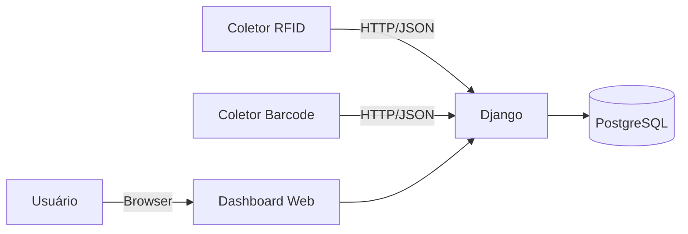

# Arquitetura

## Visão de alto nível

## Componentes do projeto
- **Django Project:** `app/` (settings, urls, wsgi)
- **Django App:** `rfid/` (models, views, templates, utils)
- **Banco:** PostgreSQL em produção (Railway) e SQLite em desenvolvimento (fallback)
- **Static:** WhiteNoise para servir arquivos estáticos

## Principais entidades (resumo)
- **Botijao:** cadastro do cilindro (atual: identificado por `tag_rfid`)
- **LeituraRFID:** eventos de leitura RFID ligados ao Botijao
- **LeituraCodigoBarra:** eventos de leitura de barcode (atual: não vinculado ao Botijao)
- **LogAuditoria:** trilha de auditoria para ações relevantes
- **ImportacaoXLS:** registro de importações de planilhas

## Pontos de atenção (boas práticas)
- Configurado `ALLOWED_HOSTS` e `CSRF_TRUSTED_ORIGINS` via variáveis de ambiente
