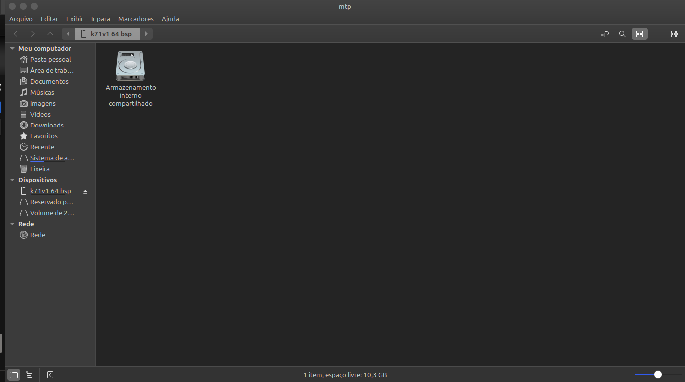
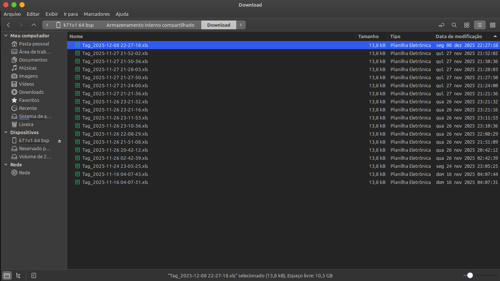
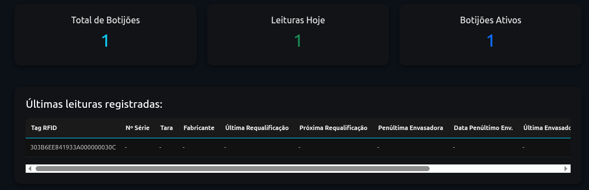
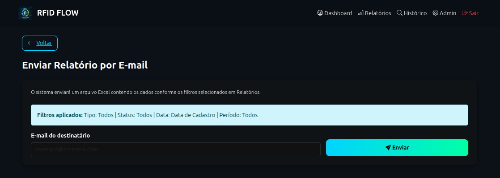
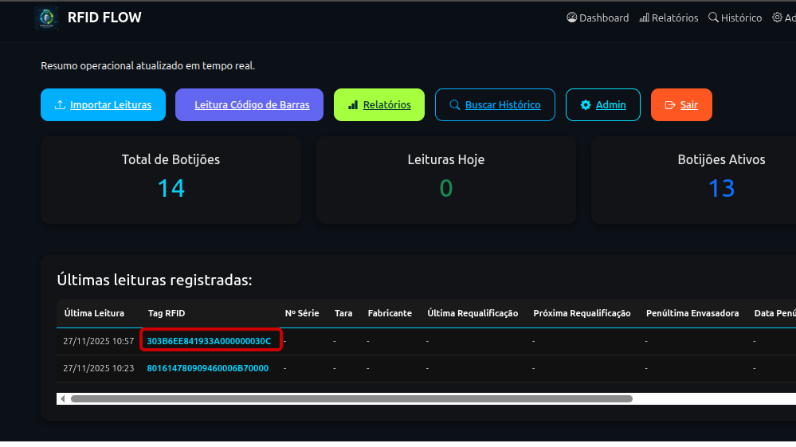

# **RFID Flow System** 

Sistema Web para gestão, rastreamento e controle operacional utilizando leituras RFID e importação manual de arquivos.

O objetivo do RFID Flow System é permitir que empresas controlem o fluxo de ativos (botijões de gás) utilizando leituras de etiquetas RFID, combinadas com funcionalidades administrativas e relatórios em tempo real.

## **📌 Visão Geral** 

O **RFID Flow System** é uma aplicação **100% Web**, desenvolvida em **Python + Django**, que permite:

-   Gerenciar ativos com identificação RFID.

-   Registrar leituras feitas em dispositivos externos (leitores RFID, PDAs, coletores).

-   Visualizar relatórios operacionais, dashboards e estatísticas.

-   Gerenciar usuários, permissões, logs e auditorias.

-   **Importar leituras manualmente** por meio de um arquivo XLS/XLSX gerado por um dispositivo local.

-   Ler códigos de barras

O sistema é ideal para operações logísticas, industriais e distribuidoras que precisam de rastreabilidade e controle.

**Infraestrutura:**

-   Deploy em **Railway**

**Feature Local Integrada (Opcional):**

-   Importação manual de arquivo .xlsx gerado por dispositivo RFID.

-   Leitura ocorre localmente no equipamento → arquivo é carregado no sistema Web.

## **Setup do Projeto (Desenvolvimento)** 

### **1. Local do repositório** 

git clone [https://github.com/Saulo-Azevedo/rfid-flow-system.git\
](https://github.com/Saulo-Azevedo/rfid-flow-system.git)cd rfid-flow-system

### **2. Criar superusuário** 

Criado pelo desenvolvedor para testes, abaixo credenciais de acesso:\
[Usuário:] ***

[Senha:] ******

### **3. Servidor** 

Serviço hospedado temporariamente no endereço

Acesse em:\
👉 [web-production-fd2d9.up.railway.app]

### **4. Feature Local (Importar Leituras)** 

Embora o sistema seja totalmente Web, ele possui uma funcionalidade que depende de um arquivo gerado localmente.

Essa funcionalidade NÃO depende de app RFIDFLOW --- é uma forma segura de redundância.

Fluxo operacional:

1.  Acessando o APP UHF-G ele verá essa imagem:

2.  Pode escolher ler Uma TAG ou fazer Inventário com várias

3.  Dispara no dispositivo com gatilho para iniciar a leitura, para pausar bastar apertar o gatilho novamente.

4.  Ele tem a opção de no dispositivo clicar no botão START para iniciar e no STOP para parar.

5.  Operador verá as leituras na tela e clica no botão (EXPOORT_EXCEL)

6.  Com sistema logado, operador clica no botão [Importar Leituras]{.underline} acessando essa tela:

-   Clicamos no botão Escolher Arquivo:

-   No Explorer local, escolha a pasta onde está o dispositivo (Exemplo k71v1) e acesse o armazenamento do dispositivo:

-   Navegue até pasta Download, localize a última leitura salva, clique no botão Selecionar:

-   O arquivo selecionado aparecerá na tela indicando sucesso na captura do dispositivo:

-   A Função Pré-visualizar Dados, serve como uma conferência antes de inserir os dados no sistema:

-   Se os dados estiverem corretos, operador confirma e faz a importação inserindo os dados no sistema:

Clicando em Voltar ele confere que o dashboard já vai ter as informações lidas.

### **5. Coleta e Sincronização de Tags RFID (App RFIDFLOW)** 

Diferente do processo manual via exportação de arquivos, o sistema agora conta com integração direta através do aplicativo **RFIDFLOW**, instalado no coletor. Os dados são enviados automaticamente para o sistema Web assim que capturados.

#### 5.1. Preparação 

1.  Ligue o dispositivo coletor.

2.  Certifique-se de que o dispositivo possui conexão com a internet (Wi-Fi ou 4G).

3.  Acesse o aplicativo **RFIDFLOW**.

#### 5.2. Modos de Operação 

O operador pode escolher entre dois métodos de leitura, dependendo da necessidade da operação:

  -----------------------------------------------------------------------------------------------
  **Leitura Única**     Captura uma tag por vez. Ideal para conferências pontuais ou identificação de ativos específicos.      Gatilho físico do coletor (Trigger).

  **Modo Inventário**   Captura múltiplas tags continuamente. Ideal para varreduras de estoque ou grandes volumes de ativos.   Botão \"Iniciar\" na tela ou atalhos físicos.
  ----------------------------------------------------------------------------------------------------------------------------------------------------------------------------

###  

#### 5.3. Operação do Modo Inventário (Atalhos Rápidos) 

Para maior agilidade e ergonomia, o operador pode controlar a coleta através dos botões físicos laterais (laranjas) do coletor, sem necessidade de tocar na tela:

-   **Botão Laranja Esquerdo:** Inicia a leitura contínua (Inventário).

-   **Botão Laranja Direito:** Interrompe a leitura e finaliza a sessão de coleta.

#### 5.4. Processamento de Dados 

Uma vez que as tags são lidas, o aplicativo envia os dados instantaneamente para o **backend** do sistema Web, que realiza:

1.  **Validação Automática:** Cruza os EPCs lidos com o banco de dados.

2.  **Registro de Movimentação:** Atualiza horários e locais das leituras.

3.  **Cadastro Dinâmico:** Caso um EPC pertença a um novo ativo, o sistema cria o registro automaticamente.

4.  **Feedback em Tempo Real:** O resumo de sucessos e alertas aparece diretamente na tela do coletor/sistema.

### **6. Coleta de Código de Barras (App BarcodeFlow)** 

Além da tecnologia RFID, o sistema permite a coleta ágil de códigos de barras tradicionais através do aplicativo **BarcodeFlow**. Este processo elimina a digitação manual, enviando os dados em tempo real para o painel administrativo.

#### 6.1. Preparação 

1.  No coletor PDA, certifique-se de que a janela do scanner (topo do aparelho) esteja limpa.

2.  Abra o aplicativo **BarcodeFlow**.

3.  Verifique se o dispositivo está conectado à internet para que as leituras apareçam instantaneamente no sistema Web.

#### 6.2. Fluxo de Operação 

O processo de leitura é simplificado para garantir velocidade na operação:

1.  **Posicionamento:** Aponte o feixe de laser do coletor para o código de barras.

2.  **Gatilho:** Pressione qualquer um dos **botões laterais laranjas** para acionar o scanner.

3.  **Registro:** O app fará a leitura \"uma por vez\". Assim que o código é bipado, ele é enviado automaticamente.

> 

#### 6.3. Monitoramento no Sistema Web 

As leituras podem ser acompanhadas em tempo real pela equipe administrativa através do menu: **Dashboard → Leitura Código de Barras**

Nesta tela, o sistema exibe:

-   **Último código recebido:** Destaque para o código que acabou de ser lido (ex: 7896020162957).

-   **Totalizador:** Quantidade de leituras realizadas no dia.

-   **Tabela de Registros:** Detalhamento com a origem (PDA), o operador responsável e a data/hora exata da coleta.

#### 6.4. Diferenciais do Processo 

-   **Envio Automático:** Não é necessário conectar o coletor ao computador via cabo para descarregar os dados.

-   **Validação em Tempo Real:** O sistema registra a leitura via ADB/Internet e já disponibiliza para consulta imediata no banco de dados.

-   **Ergonomia:** O uso dos botões laterais físicos facilita a operação contínua, permitindo que o operador segure o dispositivo com firmeza enquanto realiza as coletas.

### **7. Gestão de Relatórios e Exportação** 

O módulo de relatórios permite uma análise detalhada e filtrada de toda a operação de leitura (RFID e Código de Barras). Os dados são consolidados em tempo real e podem ser exportados para gestão externa.

#### **7.1. Filtros de Pesquisa** 

-   Para refinar os dados exibidos, o sistema oferece quatro camadas de filtragem:

-   Tipo de Leitura: Permite isolar os registros por tecnologia, selecionando apenas RFID ou apenas Código de Barras.

-   Status do Ativo: Filtra os botijões/ativos por situação atual (Ativo, Inativo ou em Manutenção).

-   Referência de Data: Define se o período buscado deve considerar a Data de Cadastro do ativo ou a Data de Leitura realizada pelo operador.

-   Período (Início e Fim): Seleção precisa do intervalo de datas conforme a necessidade da análise.

#### **7.2. Indicadores em Tempo Real (Cards)** 

-   Ao aplicar um filtro, o sistema atualiza instantaneamente os painéis de resumo:

-   Botijões Filtrados: Quantidade de ativos únicos que correspondem aos filtros aplicados.

-   Registros Analisados: Volume total de bips/leituras processadas no período.

-   Total Atual de Leituras: Somatório geral consolidado das operações recentes.

#### **7.3. Ações e Exportação** 

-   O sistema conta com dois botões principais de ação que são estritamente vinculados aos filtros selecionados:

-   Exportar Excel: Gera um arquivo XLS/XLSX contendo apenas os dados que estão visíveis na tela após a filtragem. Ideal para auditorias e relatórios gerenciais externos.

-   Enviar Relatório: Processa ou encaminha a listagem filtrada para integrações ou destinos pré-configurados.

-   [Atenção: Certifique-se de conferir os filtros antes de clicar em Exportar, pois o arquivo gerado conterá exatamente o que você visualiza nos cards e tabelas.]{.underline}

### **8. Consulta de Histórico Detalhado** 

O sistema oferece uma ferramenta poderosa de rastreabilidade, permitindo que o operador visualize o \"ciclo de vida\" completo de um ativo (botijão) específico, desde dados técnicos até o histórico de envasamento e leituras.

#### **8.1. Como Acessar** 

Existem duas formas principais de acessar essa funcionalidade a partir do Dashboard principal:

1.  **Acesso Direto via Tabela:** No Dashboard, ao visualizar a tabela de \"Últimas leituras registradas\", você pode clicar diretamente sobre o código da **Tag RFID** (destacado em azul). Isso abrirá o Histórico já filtrado automaticamente para aquele ativo específico.

2.  **Menu Buscar Histórico:** Ao clicar no botão azul **Buscar Histórico** no topo do Dashboard, você será levado à tela de busca manual. Neste caso, é necessário digitar ou ler o código da tag no campo de busca e clicar em \"Buscar\".

#### **8.2. Estrutura de Informações (Abas)** 

Uma vez selecionado o ativo, as informações são organizadas em quatro abas principais para facilitar a navegação:

-   **Informações Gerais:** Exibe os dados cadastrais básicos como o número da Tag RFID, número de série, fabricante, tara (kg) e o total acumulado de leituras.

-   **Requalificação:** Apresenta o status atual de requalificação (ex: Pendente) e as datas da última e próxima requalificação programada.

-   **Envasamento:** Detalha o histórico de enchimento, mostrando dados da última e penúltima envasadora, bem como as respectivas datas de operação.

-   **Leituras:** Lista todas as interações recentes com o ativo, registrando Data/Hora, o Operador responsável e a Observação da origem da leitura (ex: \"Enviado pelo App Chainway\").

#### **8.3. Status de Monitoramento** 

No canto superior direito de qualquer aba do histórico, o sistema exibe um selo de **Status** (ex: Ativo), permitindo identificar rapidamente a situação operacional do botijão no momento da consulta.

## **Testes** 

Testes foram efetuados até o momento com uma TAG RFID Genérica, simulando a operação.\
Assim que recebermos as TAGs definitivas, vamos limpar o banco de testes e implementar testes reais com as novas.

## **⚠️ Ponto de Atenção** 
-   Definir hospedagem e domínios próprios do contratante

-   Importação depende de arquivo gerado pelo dispositivo (processo manual).

## **📚 Documentação Complementar (Opcional)** 

Tela inicial de Login -- informar Usuário e Senha:

Ao clicar no botão (ENTRAR NO SISTEMA), terá acesso aplicação 

Agora dentro do sistema, o Usuário vê a tela Inicial com todas as funções:

-   ✔ Dashboard completo:

Painel com Total de Botijões, Leituras Hoje, Botijões Ativos

Tabela contendo dados importantes referentes as leituras efetuadas

-   ✔ Importar Leituta XLS/XLSX

-   ✔ Leitura código de Barras

-   ✔ Relatórios

-   ✔ Buscar Histórico

-   ✔ Admin

-   ✔ Sair

Veja modelo da planilha em anexo a documentação.

### Função Enviar Relatório:

Dentro dessa função temos o envio do relatório geral, nela inserimos o e-mail onde o destinatário recebe relatório completo, ao clicar em ENVIAR.

[Ponto importante:]{.underline} durante o desenvolvimento o e-mail é disparado para uma conta de teste, posteriormente será atualizado para uma conta real informado pelo contratante.

### Função Admin:

Esse acesso é onde toda manutenção poderá ser feita no sistema.

Aqui o administrador tem acesso a modificar tudo que for necessário, mas exige um ponto de atenção pois qualquer dado pode ser apagado ou alterado.

Para acessar esse painel o usuário precisará de permissão, usuários comuns não tem acesso a essa funcionalidade, por padrão ele só podem visualizar as informações.\

