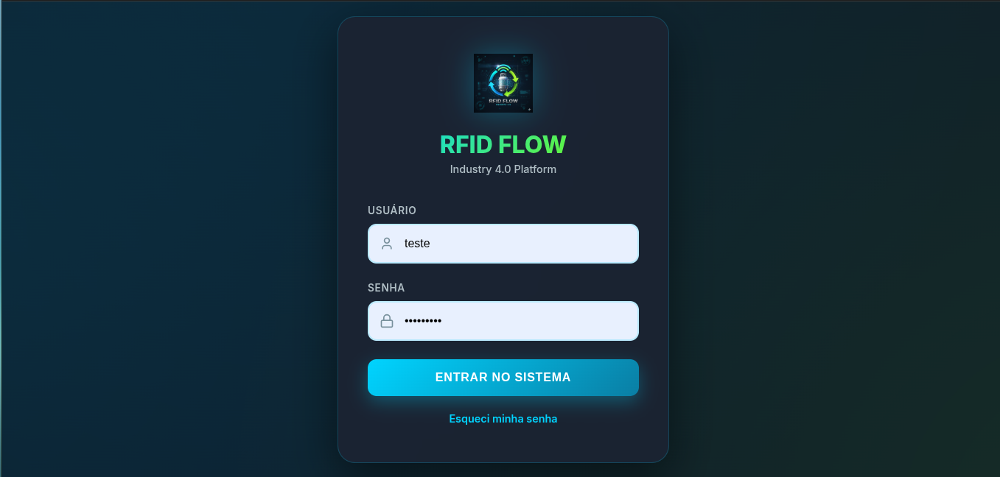
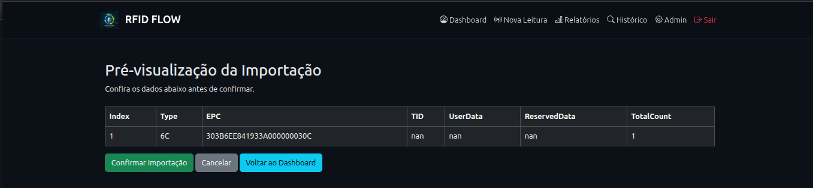
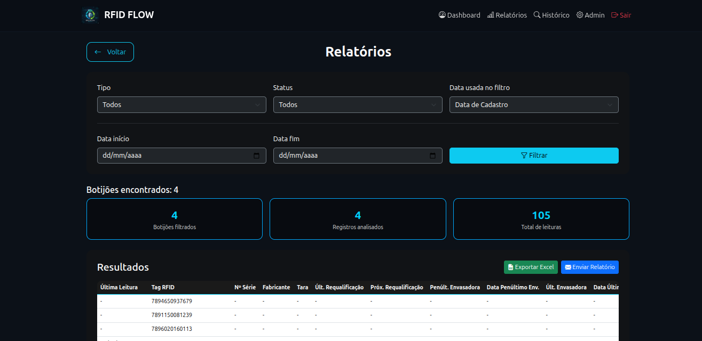
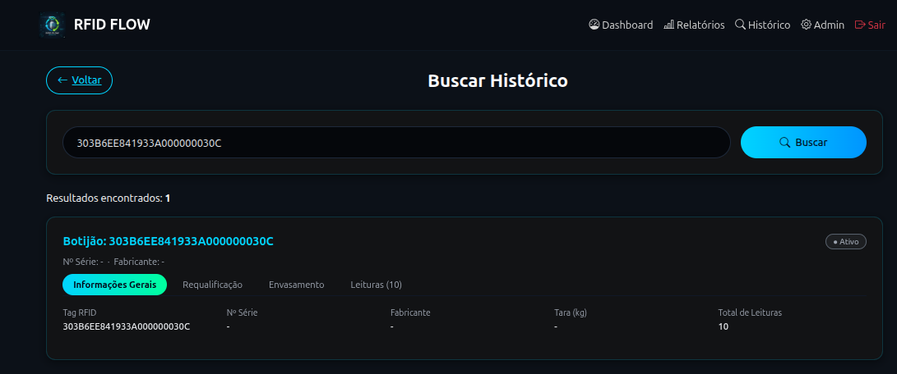

# Manual do Operador — RFID Flow

Este manual descreve **exclusivamente as operações do dia a dia** do sistema RFID Flow.  
Destina-se a **operadores de campo e usuários operacionais**, sem acesso administrativo.

---

## 1. Visão Geral

O RFID Flow é um sistema web que permite o registro e acompanhamento de leituras de ativos (botijões) por meio de:

- Leitura RFID via aplicativo RFIDFLOW
- Leitura de Código de Barras via aplicativo BarcodeFlow
- Importação manual de arquivos XLS/XLSX
- Consulta de histórico e geração de relatórios

---

## 2. Acesso ao Sistema

1. Acesse a URL informada pelo administrador.
2. Informe **usuário e senha**.
3. Após o login, o operador terá acesso apenas às funções operacionais.

---

## 3. Importação Manual de Leituras (XLS/XLSX)

Esta funcionalidade permite importar leituras geradas localmente por dispositivos RFID.

### Fluxo operacional

1. No dispositivo RFID, realize a leitura (TAG única ou inventário).
2. Exporte o arquivo XLS/XLSX no dispositivo.
3. No sistema web, clique em **Importar Leituras**.
4. Selecione o arquivo no computador.

5. Utilize a **Pré-visualização** para conferência.
6. Confirme a importação.

Após a confirmação, os dados passam a integrar o dashboard.

---

## 4. Coleta de Tags RFID (App RFIDFLOW)

### 4.1 Preparação

- Ligar o coletor RFID
- Garantir conexão com internet
- Abrir o aplicativo **RFIDFLOW**

### 4.2 Modos de Operação

| Modo | Descrição | Acionamento |
|----|----|----|
| Leitura Única | Captura uma TAG por vez | Gatilho físico |
| Inventário | Captura múltiplas TAGs continuamente | Botão Iniciar |

### 4.3 Atalhos Físicos

- Botão laranja esquerdo → iniciar inventário
- Botão laranja direito → finalizar leitura

### 4.4 Processamento

As leituras são enviadas automaticamente ao sistema, que:
- Valida EPCs
- Registra movimentações
- Cria ativos automaticamente quando necessário

---

## 5. Coleta de Código de Barras (App BarcodeFlow)

### 5.1 Operação

1. Abrir o aplicativo **BarcodeFlow**
2. Apontar o scanner para o código
3. Pressionar o gatilho físico

### 5.2 Monitoramento

Acompanhe em tempo real no menu  
**Dashboard → Leitura Código de Barras**

---

## 6. Relatórios e Exportação

O módulo de relatórios permite filtrar e analisar as leituras.

### Ações disponíveis

- Exportar Excel
- Enviar Relatório por e-mail

> Atenção: o relatório gerado reflete **exatamente os filtros aplicados**.

---

## 7. Consulta de Histórico Detalhado

Permite rastrear todo o ciclo de vida de um ativo.

### Formas de acesso
- Clique na TAG na tabela do dashboard
- Botão **Buscar Histórico**

### Abas disponíveis
- Informações Gerais
- Requalificação
- Envasamento
- Leituras

---

## 8. Observações Importantes

- O operador não possui acesso administrativo
- As leituras dependem de conectividade com a internet
- O sistema registra todas as operações automaticamente
